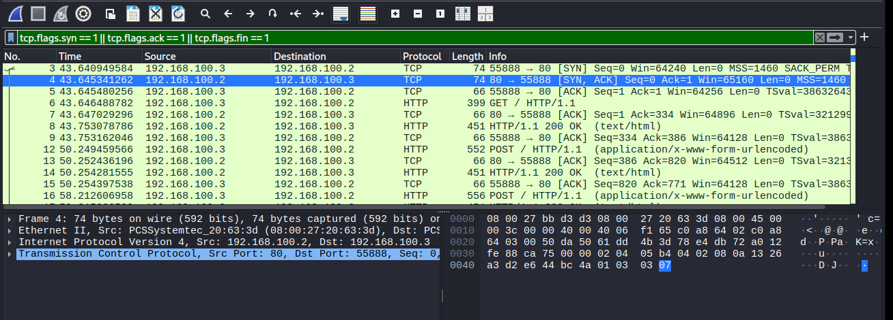
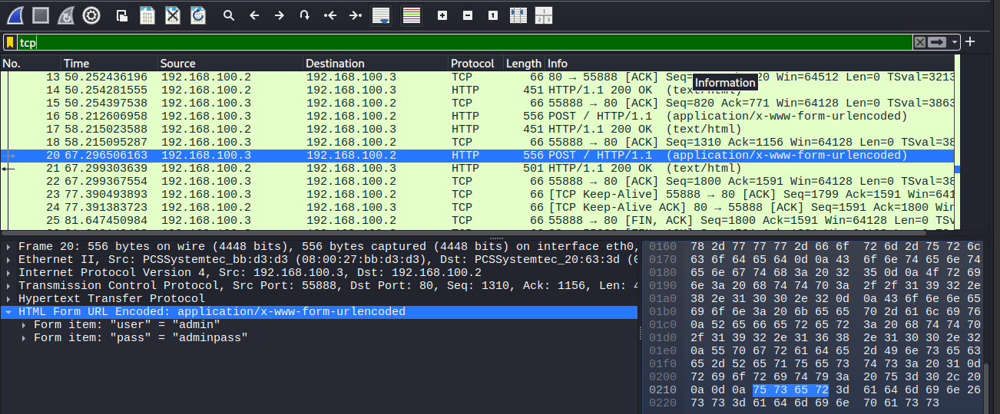

## Analizador de paquetes de red
En la comunicacion entre dispositivo informaticos atraves de una red, se es posible interceptar las tramas de comunicacion de estos dispositivos por un computador diferente que este en la misma red, esto se hace con software de anilicis de trafico de red como lo vendria a ser wireshark 

El proposito de este ejercicio es capturar esas tramas de comunicacion, analizar los paquetes y ver como se lleva a cabao la comunicacion de dos dispositivos.

Adicionalmente hemos creado un laboratorio vulnerable, que usa un protocolo de comunicacion insegura **HTTP** que puede llevar a interceptar por medio de texto sin cifrar credenciales de registro, los pasos que seguiremos son

1) Creacion de laboratorio
  - (Mquina victima) Creacion de servicio vulnerable **HTTP** en un Ubuntu server 
  - (Maquinca atacante) Creacion de una maquina kali desde donde capturaremos las tramas de comunicacion

2) Configuracion de red

3) Despliegue de servicio y sniffer de comunicacion

4) Concluciones

## Creacion de laboratorio

### Maquina victima

Vamos a utilizar una maquina virtual Ubuntu server desde la cual vamos a desplegar un servicio que usa HTTP, para lo cual instalaremos Nginx que nos va a permitir desplegar servidores web:

- sudo apt update = Descarga paquetes para actualizar el sistemas
- sudo apt upgrade = Instala los paquetes para la acutalizacion del sistema
- sudo apt install nginx = Instalacion de Nginx
- nginx -v = Verificacion de la isntalacion de nginx

Nginx nos va a crear dos ficheros importantes en las siguientes rutas

- **/etc/nginx/sites-available** = aqui se aloja el fichero ***default*** con la informacion predeterminada para el servidor web, como el puerto de escucha, el directorio raiz de la pagina web y el manejo de errores

- **/var/www/** = aqui podremos crear el directorio que contendra el archivo que sera desplegado en el servicio ya definido

creamos un fichero .php en la ruta /var/www/html que contendra un loggin para un usuario que una vez registrado mostrara informacion sensible sobre el perfil de un adminisrador del servidor el cual podra ser usardo en un futuro para vulneralo y desarroallar una escalada de privilegios, el servicio sera expuesto a la red local desde donde interceptaremos la comunicacion, la informacion de fichero sera la siguiente:

<!-- /var/www/html/login.php -->
<form method="POST">
  <input name="user" placeholder="Usuario">
  <input name="pass" type="password" placeholder="Contraseña">
  <input type="submit">
</form>

<?php
if ($_POST['user'] == 'admin' && $_POST['pass'] == 'adminpass') {
  echo "Bienvenido admin. Las credenciales del sistema son: ";
  echo "Usuario: webuser ";
  echo "Contraseña: 123456 ";
} else {
  echo "Acceso denegado.";
}
?>

- systemctl status nginx = verficamos el estado de nginx que este activado y corriendo
- curl http://localhost = vemos el php que se esta exponiendo actualmente, verficamos si el que nosostros queremos

### Maquina atacante
Creamos una maquina virtual con una distribucion de kali linux, una ves creada esta maquina la unica herramienta que usaremos es wireshark, la instalamos y ejecutamos para poder analizar el trafico de red

- sudo apt update = Descarga paquetes para actualizar el sistemas
- sudo apt upgrade = Instala los paquetes para la acutalizacion del sistema
- sudo apt install wireshark = Instalacion de wireshark

## Configuracion de redes
Para nuestro laboratorio, vamos a configurar la red en la que se conecta para que las maquinas sean visibles entre si.

Con nuestras maquinas virutales apagadas. vamos ala seccion de configuracion el apartado de red y en el apartador 1
1) seleccionamos **Red interna**
2) le damos un nombre a la red
3) opcionalmente en el adaptador 2 podemos conectar las maquinas a NAT para que tengan salida a internet

una vez echo esto en la configuracion de las maquinas apagadas, las prendemos y configuramos la red desde la consola, los siguientes comandos nos van a ayudar a poner orden a nuestra red:

- ip link: Revisamos y configruamos las interfaces de red veremos los nombres de redes que tenemos algo como: (enp0s3, enpo0s8, lo, eth0, eth1)
- ip link show enp0s3 = vemos que la interfaz de red este activa  (UP)
- sudo ip link set enp0s3 up = activamos la red
- sudo ip addr add 192.168.100.2/24 dev enp0s3 = asignamos la ip a la maquina victima
- sudo ip addr add 192.168.100.3/24 dev eth0 = asigmanos la ip a la maquina atacante

cabe re calcar que la ip debe de estar en el mismo rango, y los nombres de interfaces se usarn los que veamos en nuestro sistema

- ip link = Verificamos que se haya agregado la ip a la interfaz de red
- ip a = por si no vemos la asignacion de ip estatica a la interfaz de red
- ping 192.168.100.2 = vemos que haya comunicacion entre ambas maquinas

## Despliegue del servicio y snifer de la red:
Vemos el estado de nginx en nuestra maquina victima para asegurarno de que el servicio este corriendo **systemctl status nginx**, en nuestra maquina atacante activamos el wireshark y ingresamos desde nuestro navegador a la web, enviamos pruebas de registro y mandamos las credenciales correctas esto para experimentar como se ven este tipo de comunicaciones en la red

### Capturas de trafico de red
**Captura SYN, SYN - ACK, ACK** 

estos protocolos se ven involucrados la comunicacion y el procedimiento que siguen los dispositivos al tomar papeles de servidor y clinentes, ejemplificacion de como inicia la comunicacion entre dos maquina:

[Inicio]
Cliente → SYN → Servidor  
Servidor → SYN+ACK → Cliente  
Cliente → ACK → Servidor

[Fin]
Cliente → FIN → Servidor  
Servidor → ACK → Cliente  
Servidor → FIN → Cliente  
Cliente → ACK → Servidor

ambos son como un formalismo entre las maquinas las cuales se podria pensar en una parte que desea esteblecer una comunicacio, la segunda parte responde con intencio de aceptar y sincronizarse, y la primera confirma la recepcion de su respuesta

**Representacion de las capas involucradas en un paquete** =  en la parte inferior izquierda se puede apreciar una serie de opcines que vienen a ser la representacion de como wireshark interpreta las capas del modelo OSI y TCP/IP hay podremos encontrar informacion de un paquete en especifico que, se representa las diferentes capas por las que "atraviesa" el paquete hasta llegar el servidor o cliente si es que lleva una respuesta

1. Acceso a red  <-> Ethernet/WiFi (física + enlace)
2. Internet      <-> IP
3. Transporte    <-> TCP / UDP
4. Aplicación    <-> HTTP, SSH, etc.

Hemos establecido una comunicacion con un servicio HTTP vulnerable, lo que nos permitio observar como los datos enviados ***incluyendo credenciales*** no estan cifrados y pueden ser interceptadas por un atacante mediante tecnicas de sniffing. 

Esta falta de cifrado representa una brecha de seguridad critica. un atacante prodria aprovecharla para registrase en la aplicacion web y desde alli explorar nuevas vias para para acceder al sistema, como la carga de archivos manipulados, exposicion senslible de informacion o la interaccion con otros servicios que esten corriendo en diferentes puertos de la maquina

## 🧠 Lo que aprendimos
- Como configurar redes internas y entornos virtuales
- Como levantar un servicio web vulnerable con Nginx y PHP.
- Como sniffear trafico de red en una red local usando Wireshark.
- Como interpretar los paquetes TCP y ver datos sensibles en protocolos inseguros como HTTP.

## 🧰 Herramientas utilizadas
- **Wireshark** – Analisis de tráfico de red.
- **VirtualBox** – Gestion de mquinas virtuales.
- **Ubuntu Server** – Maquina victima.
- **Kali Linux** – Maquina atacante.
- **Nginx** – Servidor web vulnerable.