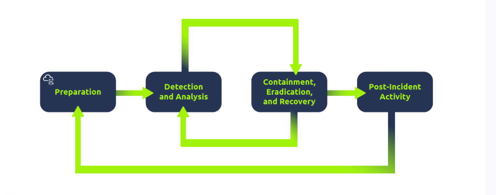

## Intro security info

La seguridad ofensiva consisten en entrar dentro de sisitemas informaticos aprovechandonos de bugs o loopholes que esten en las aplicaciones y nos permitan ganar acceso sin autorizacion

un paso como al ingresar a un sistema es usar una herramienta llamada **dirb**
<dirb http://"paginapagina.com">

## Defensive security into

Consiste en mantener a salvo un cistema informatico, de intrusos no deseados para ello las tareas de un Blue team son:
- **Concientizacion de los riesgos ciberneticos**
- **Documentacion y gestion de activos** 
- **Actualizacion y correcion en errores del sistema**
- **Configuracion de sistemas de seguridad preventivos:** firewall, IPS
- **Configuracion de equipos de registro y monitoreos**

**Topicos relacionados**
- Security operations center (SOC)
- Threat Intelligence
- Digital Forensic and incident Response (DFIR)
- Malware analysis

## Security operations center (SOC)

son los profesionales con la responsabilidad de monitoriar la red y cervicios en busca de intrusos, o detectar eventtos maliciosos algunas areas de interes del SOC son:
- **Vulnerabilities** = Cualquier sistema es vulnerable, lo importante es ecntrar esta volnerablidad y arreglar ya sea usando los paquetes actualizados necesario, una vez detectada una volnerabilidad lo urgente es arreglarla cuanto antes para mitigar los daños, aunque esto es vital para el SOC, no necesariamente es asignado a el.
- **Policy violation** = Son las reglas definidas para proteger un sistema y definir amenzas, por ejemplo no conectar USB extrañas o un trabajador que carga informacion de los empleadores a un sitio de ventas en internet
- **Unathorized activite** = Esto se puede dar cuando las credenciales de algun miembro del equipo han sido robadas, o dadas de baja, la deteccion de esta actividad podria ser considerada como sospechosa y es perentorio mitigarla antes de que pueda hacer mas daños
- **Network instrusions** = No importa que tan buena se la seguridad si un compañero da click en un enlace raro o un atacante explota un servicio publico, estas intruciones deben ser detectadas cuanto antes para mitigar los daños

El SOC cubre varias tareas para asegurar la proteccion de los sitemas una de ellas es *threat inteligence* la inteligencia de amenazas

**Threat inteligence**
En este contexto la inteligencia es la recoleccion de informacion que puede obtener el enemigo y los daños vendria a ser cualquier accion que interrumpa o rompa el sistema, la inteligencia de amenaza recolecta informacion que ayuda a la compañia a estar mejor preparada frente a un posible enemigo, desde uno que pueda detener su sistema de facturacion o secuestra sus datos

La inteligencia de amenzas necesita recoger informacion, procesar la informacion y analizar, esta informacion puede ser obtenida desde diferentes fuentes ya sea la red propia, foros de internet o registros de red, esto nos brindaria informacion sobre los motivos que tienen los posibles atacantes y por donde podrian abordarnos

## Digital forensic
La ciencia forence s ebasa en la reconstruccion de los hechos durante un incidente, en el ambito digital se utilizara para determinar como ocurrio un ataque, que daño, y que evidencias queda, puede investigar echos como una violacion a las politicas de privacidad, accesos no autorizados, ransomware o exfiltracion de datos para ello el **digital forensinc** se puede enfocar en diferentes areas

- ***file System:*** Es la revision de bajo nivel de los ficheros  o directorios del sistema, ver si fueron creadas copias, se reescribieron algunos ficheros o se eliminaron estos mismos
- ***System memory*** Si los atacante ejecturan un programa malisioso en el sistema, o hay evidencia de actividad sospechosa que no queda guardada en disco se podria detectar en tiempo real cono una revision a la memoria del sistema
- ***System logs***  Estos ficheros contienen informacion de que es lo que esta sucediendo dentro del sistema, proveen informacion clave para entender que ocurre incluso si el atacante intenta borrar sus rastros, quedarian algunas huellas
- ***Network logs*** Revisar los registros de paquetes podria a ayudar a dectectar si esta ocurriendo un ataque, que conexiones hubo y esto que implicaciones tiene

## Incident response
No todas las alertas son graves o critacas puede ser una mala configuracion, o un intento de intrucion o puede ser un ***Cyber attack*** que nos prive del ingreso al sistema, romma un servicio web o secuetre nuestra informacion, el ***Incident responce** Es una etapa vital para entender y saber que hacer antes, durante y depues de un ataque o intento de daño, esto es vital para mitigar los riesgo en la medida de los posible y mientras mas rapido sea mejor, se puede mapear en cuatro etapas

- ***Preparation*** Esto requiere un equipo entrenao y listo para saber como manejar un incidente, es ideal tene varias medidas antes de que un incidete tenga lugar en primer lugar

- ***Detection and analysis*** El equipo debe de estar listo y tener los recursos necesario para detectar cualquier incidente, es esencial para identificar el tipo de incidente y su gravedad

- ***Containment, eradication and recovery*** Una ves el inicidente fue detctado, es crucial detenerlo para que no afecte otros sistemas, eliminarlo y recuperar los sistemas infectados, por ejemplo una vez detectamos la infeccion del sistema con un virus este debe de ser detenido, antes de que infecte otros sistemas, se elimina el virus y se garantiza la adecuada recuperacion del sistema

- ***Post incident*** Despues de una recuperaccion exitosa y generar un reporte de lo sucedido hay que preguntarse que leccion aprendimos para evitar casos similares en un futuro

